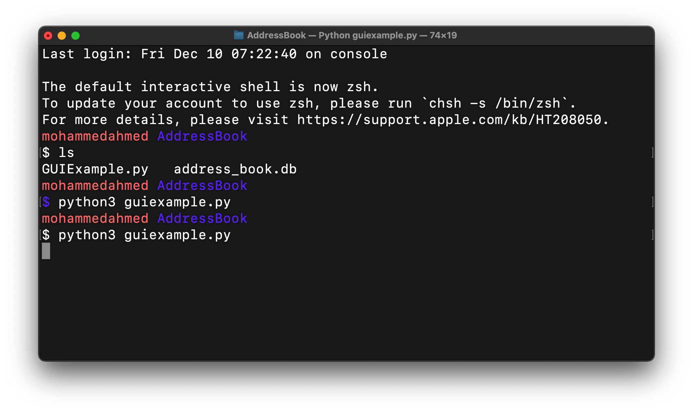
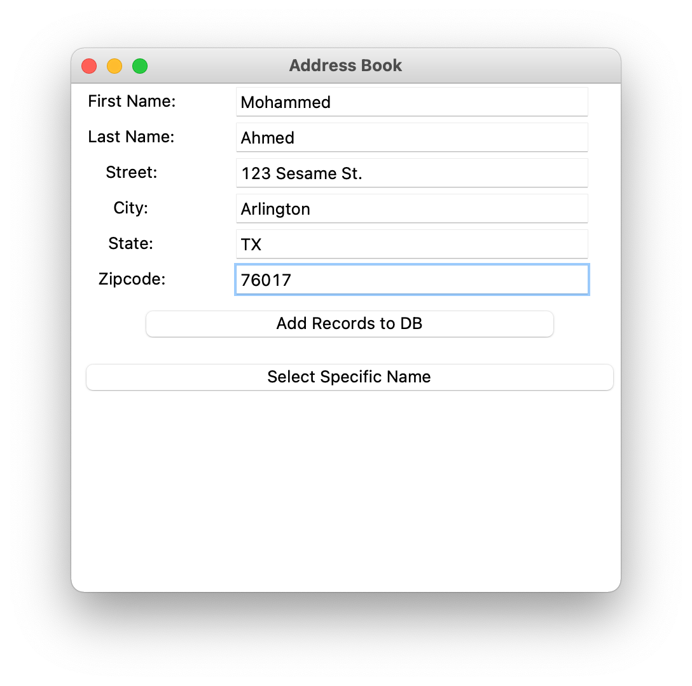
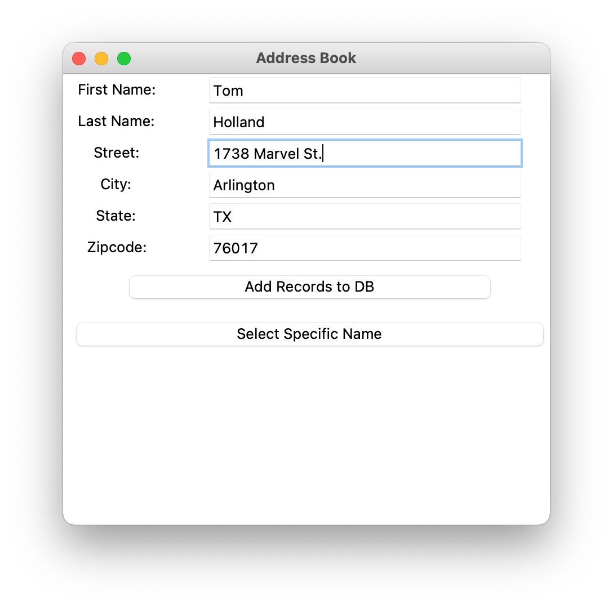

# Address Book
A simple address book GUI utilizing Python, SQL, and Tkinter

 					## How to Run
 Make sure Python and Tkinter are installed

 Type in:
 ```
 python3 guiexample.py
 ```



  ## How to Add Contact
  In order to add a contact into the database, the user must enter a value for each field, and then click 'Add Records to DB'



  Another example of adding a contact




  ## How to Retrieve Contact

	In order to retrieve a contact, the user can filter the contacts by city by typing in the specific city in the 'City' field and pressing 'Select Specific Name'

  
